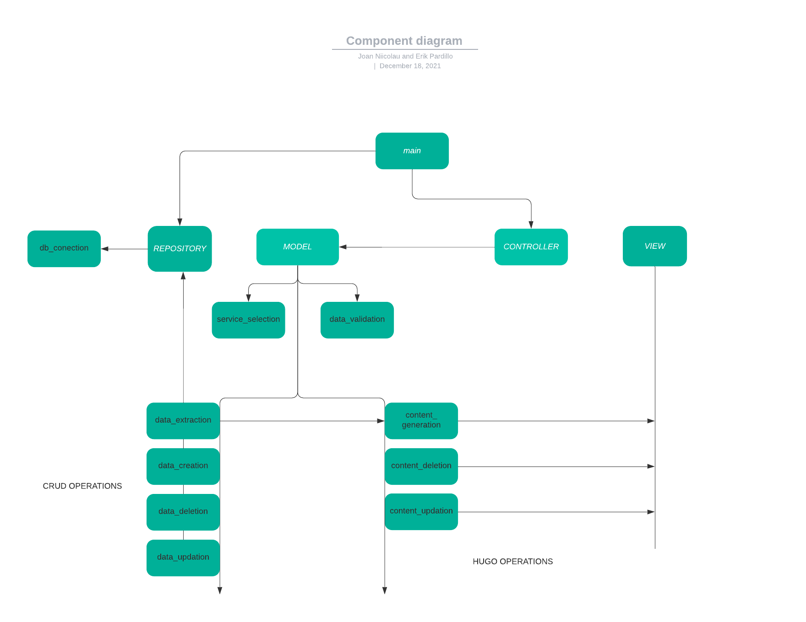
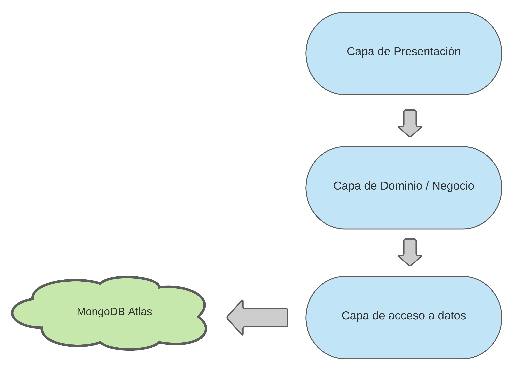
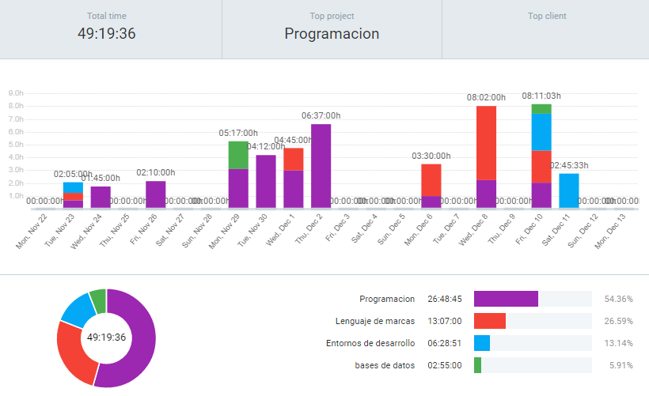

# pyDevops_UFER
---
# Introducción
Tu tutor de empresa quiere aprovechar que has llegado para intentar implementar un sistema de integración y entrega contínua (CI /CD), así que se sienta contigo a hacer una documentación técnica (es decir, unos garabatos en el papel donde venían las panades de carn amb pèsols del berenar) según se le va ocurriendo la solución (ver figura). El diagrama viene a decir algo así:
- Te propone que desarrolles una aplicación Python para extraer los datos de MongoAtlas. Se hace necesario diseñar una especificación del esquema de los documentos JSON.
- Esos documentos JSON tendrás que transformarlos, también con una aplicación Python, en ficheros Markdown.
- Luego, has de situar estos ficheros en una estructura de directorios que establece el generador de sitios estáticos llamado “Hugo”, también mediante una aplicación Python que construyas.
- Hugo, al arrancar, leerá los ficheros Markdown y los transformará en documentos HTML para servirlos en la “nueva web”.Tu tutor no ha usado nunca Hugo ni ningún otro generador de sitios estáticos, pero quieren que alguien aprenda a usarlo para evaluar su implantación en la intranet de la empresa. 
- Tendrás que customizar los estilos CSS que utiliza Hugo para darle la presentación adecuada.

# Metodologia

La metodologia usada para este proyecto fue la metodología kanban.

Esta metodología es muy sencilla, se puede actualizar y los equipos de trabajo la pueden asumir sin problema. Al ser un método visual permite que con un simple vistazo se conozca el estado de los proyectos y se puedan asignar nuevas tareas de manera muy efectiva. Para aplicarlo, es necesario un tablero de tareas con el que poder mejorar el trabajo y tener un ritmo sostenible. 

En nuestro caso, nos hemos guiado por las historias de usuario y en base a estas hemos ido desarrollando pequeñas tareas que aportaran valor a cada historia y permitieran completarlas.

# Analisis

## Primer diagrama


La primera idea fue la siguiente:

Desde el módulo Main, se puede realizar la conexión a la base de datos, visualizar la página web, un módulo que iba a controlar la lógica de Model. 

Respecto a Model, encontramos dos bloques diferenciados:
- Generate pages: crea páginas a renderizar por el SSG Hugo
    - Read: lee los documentos json de la colección y los pasa a markdown
- Acceso a datos:
    - Delete: elimina los items de la BBDD
    - Create: crea los items de la BBDD
    - Update: actualiza los items de la BBDD
## Posibles tecnologias

La principal funcionalidad es generar archivos Markdown con los datos almacenados en la base de datos MongoAtlas en el Static site generator Hugo. A continuación se especifícan las tecnologías utilizadas.

Principalmente, la aplicación gira entorno a una base de datos (BBDD), Mongodb. Mongodb es un sistema de BBDD NoSQL, orientado a documentos y de código abierto. En lugar de guardar los datos en tablas, tal y como se hace en las bases de datos relacionales, MongoDB guarda estructuras de datos BSON. Para ser más específico, se han realizado las consultas en MongoAtlas, un servicio en la nube de Mongodb.

Los datos plasmados estaban escritos en un Static site generator, el que nos indicaron usar era Hugo. Hugo es uno de los generadores de sitios estáticos de código abierto más populares. Con su asombrosa velocidad y flexibilidad.

El editor de codigo que podiamos elegir fueron VsCode, pycharm o  sublime text, aunque teniamos más opciones estas fueron las pensadas.

La aplicación ha sido desarrollada con el lenguaje de programacion python version 3.9 . Para crear el programa se han tenido que instalar las siguientes dependencias:

- Para realizar los test sobre los módulos del programa hemos usado pytest version 6.2.5.
- La conexión con la base de datos tuvimos que instalar la librería de pymongo version 3.12.1.
- Para la conexión a la BBDD con pymongo tuvimos que añadir certifi para la conexión SSL.
- La validación de los schema se ha instalado el módulo jsonchema.

## tabla de tecnologias

https://www.tablesgenerator.com/markdown_tables

# Diseño 

## Diagrama de componentes



Nuestro programa principal de compone de tres elementos esenciales y un cuarto que es el dedicado a la Static site gen:

- repository
- model
- controller
- view

### repository

Aquí tenemos el módulo db_conection, es el que se encarga de establecer la conexión con la base de datos.

### model

Se centra en el CRUD "Crear, Leer, Actualizar y Borrar" de la BBDD. Por eso lo vinculamos con repository. También almacenando otras utilidades que le ayuda a realizar dichas actividades.

En este módulo tenemos un módulo para verificar los datos y uno que usaremos para seleccionar los servicios.

- service_selection
- data_validation

Los módulos,que dependen de repository ya que la conexión con la BBDD es necesaria, realizarán el CRUD son:

- data_extraction: para leer los datos, aparte contiene la funcionalidad de pasar los datos para ser visualizados en el Static site generator.
- data_creation: este módulo pide al usuario los datos para crear un documento en la BBDD
- data_deletion: es el encargado de eliminar los datos del usuario.
- data_updation: se encarga de actualizar los datos de la BBDD

Aparte encontramos los módulos encargados de usar los datos de la BBDD en Hugo:

- contente_generation: depende de los datos extraidos, se encargará de generar los archivos que se visualizarán en Hugo.
- content_deletion: se encarga de cuando se eliminen los datos , actualice la página y desaparezca la página dedicada a ese item
- content_updation: es la encargada de que cuando se cambien los datos de un item sean actualizados en el archivo de Hugo.

### view

El repositorio view, contiene todo lo necesario para iniciar Hugo con su configuración correspondiente. Por este motivo View depende de todos los módulos content, ya que son los que hacen que se actualice y genere la información de la página.

### controller

El controller es totalmente dependiente de model, ya que es el encargado de crear un menu para controlar las funcionalidades que hay en model.

## Esquema de BBDD
```python 
{
    "type": "object",
    "properties": {
        "name": {"type": "string"},
        "description": {"type": "string"},
        "driver": {"type": "string"},
        "passengers": {"type": "number"},
        "privacy": {"type": "string"},
        "seats": {"type": "string"},
        "propulsion": {"type": "string"},
        "top_speed": {"type": "number"},
        "price": {"type": "number"},
        "amenities": {"type": "array"}
    }
}
```

## Futuras Pruebas

Las pruebas seleccionadas principalmente son sobre el CRUD de la aplicación.

Se probara como se elimina un item de la base de datos, como se actualizará un documento en la base de datos y como se creará un documento.

Además, se usarán markers personalizados para hacer tests unitarios de cada módulo. 

En el fichero pytest.ini se encuentran todos los markers.

También se harán tests de regresión para comprobar que los tests ya pasados siguen pasando.

# Implementación

## Herramientas técnicas

Como hemos comentado anteriormente, hemos acabado usando vscode por su ayuda con las extensiones a la hora de escribir el código y pycharm frente a la gestión de la infraestructura y el manejo de los módulos, además de las facilidades aportadas en relación al entorno virtual y la implementación de código de calidad según PEP 8.

Los módulos python comentados en el apartado de posibles tecnologías finalmente fueron utilizados para la conexión de la base de datos y la validación del schema.

## Backend
Lo encontramos en los módulos dentro de Model.

Los referentes a content se encargan para actualizar los directorios de Hugo:

- content-deletion: en el momento en que se elimine un item de la base de datos, también lo hará en el sitio web.

``` python 

def delete_service(service):

    # tell the user which service wants to delete
    # input('Service to delete: ').strip().title()
    service_to_delete = service

    if file_exists(destiny, service_to_delete, file_type):
        os.remove(destiny + service_to_delete + file_type)
    else:
        print("The service doesn't exists")


```
- content_generation: genera los archivos markdown en el directorio de contenido de Hugo para que los items sean visualizados.
  
``` python
def generate_files(collection):
    # counter for every file added
    counter = 0
    # list of dicts (ufer data)
    ufer_docs = load_data(collection)

    for index, doc in enumerate(ufer_docs):

        if not file_exists(destiny, doc['name'], file_type):

            template = generate_template(ufer_docs, index)

            with open(destiny + doc['name'] + file_type, 'w', encoding='UTF-8') as my_file:
                counter += 1
                my_file.writelines(template)

    # items added
    if counter == 0:
        print('content already up to date')
    else:
        print('items added to the website:', counter)
```
- content_updation: en este módulo se actualiza el precio del item de la pagina seleccionado

``` python
def update_service_price(info, destination, file_type):

    if info is not None:

        # open file in read mode
        try:
            file = open(destination + info['name'] + file_type, "r")

        except FileNotFoundError:
            print('file not found')

        else:
            replacement = ''

            # loop through the file
            for line in file:
                line = line.strip()
                changes = line.replace(str(info['current_price']), str(info['new_price']))
                replacement = replacement + changes + "\n"

            file.close()

            # open file in write mode
            fout = open(destination + info['name'] + file_type, "w")
            fout.write(replacement)
            fout.close()
            return True
    else:
        return False
```
En cuanto a los módulos data, son los que representan el CRUD a la BBDD:

- data_creation (C):
``` python
def create_service(collection):
    # generate empty_values document
    document = {
        "name": "",
        "description": "",
        "driver": "",
        "passengers": 0,
        "privacy": "",
        "seats": "",
        "propulsion": "",
        "top_speed": 0,
        'price': 0,
        "amenities": []
    }

    user_instructions = "Para crear un servicio, sigue el siguiente schema:\n" "\n \t\"name\": \"\"," \
                        "\n\t\"description\": \"\",\n\t" "\"driver\": \"\",\n\t\"passengers\": \"\"," \
                        "\n\t\"privacy\": \"\",\n\t\"seats\": \"\",\n\t\"propulsion\": ""\"\",\n\t\"top_speed\": " \
                        "0,\n\t\"amenities\": []\n\t  "

    # tell the user how to fill the values
    print(user_instructions)

    # fill document values (depending on the value type it has)
    for index in range(len(PYDEVOPS_KEYS)):
        if PYDEVOPS_VALUE_TYPES[index] == str:
            if PYDEVOPS_KEYS[index] == 'name':
                document[PYDEVOPS_KEYS[index]] = fill_string(PYDEVOPS_KEYS[index]).title()
            else:
                document[PYDEVOPS_KEYS[index]] = fill_string(PYDEVOPS_KEYS[index])
        elif PYDEVOPS_VALUE_TYPES[index] == int:
            document[PYDEVOPS_KEYS[index]] = fill_int(PYDEVOPS_KEYS[index])
        elif PYDEVOPS_VALUE_TYPES[index] == list:
            document[PYDEVOPS_KEYS[index]] = fill_array()
```
Se recorren las variables globales que almacenan las claves y los valores del schema y en función del tipo de dato se usan diferentes operaciones para llenar los valores del documento a enviar a la BBDD.

## Arquitectura y tecnologias usadas

### Arquitectura de la app



La arquitectura de la aplicación se divide en tres capas y una entidad diferenciada:

- Capa de presentación: donde se muestra la página y el usuario interactua con el controlador.

- Capa de Dominio / Negocio: donde reside la lógica de la aplicacion.

- Capa de acceso a datos: la capa que accede a los datos almacenados en una base de datos en la nube.

- MongoDB Atlas: es la base de datos en la nube sobre la cual interactua la aplicación.

 los schema se ha instalado el módulo jsonchema.

## Clockify

A continuación se mostrarán las horas invertidas en el proyecto, separada en sus respectivas asignaturas.



## Frontend

La página web se encuentra el la carpeta src/view/minimal donde se aprecia la estructura de directorios de Hugo.

En nuestro caso, creamos el tema desde cero y todavía necesita ser mejorado.

Hicimos cambios en el config.toml para poder renderizar html dentro de los archivos markdown dentro del directorio content, además de especificar las amenities como taxonomies.

Respecto al esqueleto de la página, en el directorio layouts encontramos _default, partials, services y el archivo index.html

El archivo index.html hace referencia a partials/pagecontent.html donde se muestra el contenido de la página y el título usando variables (.Cotent y .Title) de Hugo entre {{}}.

En _default se definen los esqueletos de las páginas de tipo single y de tipo list además de la base de todos los html de las páginas de la web.

En baseof.html se definen el head, el nav, el body, el main y el footer. Donde se usan variables de Hugo para definir un title diferente en cada página. También se define el main y el footer recibe el año en que nos encontramos (particularidad de Hugo para determinar el año en que nos encontramos)

En single.html se define la base del html en cada página de contenido que no sea de servicios de ufos. 
Simplemente se visualiza el contenido de la página de los archivos markdown.

En list.html se renderiza el html para las páginas que listan los servicios ofrecidos en la web, donde se aprovecha la lógica de Hugo para hacer un bucle sobre todos los títulos de los contenidos para mostrar los servicios en un menú vertical.

En services/single.html se enseña una lista con todos los servicios al igual que en list.html, además de enseñar el contenido de los ficheros markdown situados en la carpeta content/services

En la página de amenities, 

Finalmente tenemos la carpeta content, donde encontramos el contenido de la web.

_index.md hace referencia al contenido de la página index que nos aparece la primera al lanzar Hugo.

En review.md la idea era hacer un formulario para enviar datos a la base de datos para valorar los servicios, por lo tanto todavía está en proceso.

Y en services encontramos todos los servicios de ufos que se ofrecen en la página en forma de ficheros markdown.


